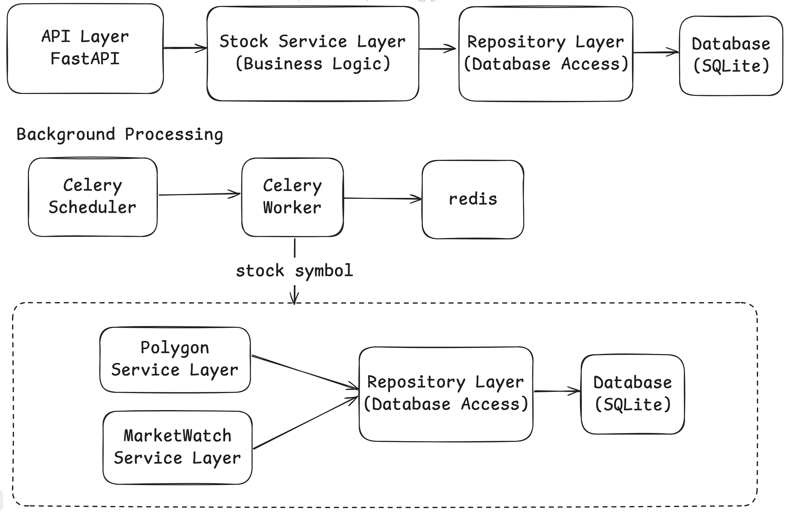

# Stocks REST API

A REST API system for managing stock data with external integrations and background processing.

## What the System Does

The system fetches stock data from two sources:

-   **Polygon.io** - Real-time market data (price, volume, etc.)
-   **MarketWatch** - Performance metrics (percentage changes)

The system also:

-   Stores data in a database
-   Maintains cache for better performance
-   Updates data in background every 15 minutes
-   Allows users to track how many stocks they purchased

## Architecture

The system follows a layered architecture:



**Main Flow:**

1. **API Layer** receives HTTP requests
2. **Service Layer** handles business logic and external API calls
3. **Repository Layer** manages database operations
4. **Database** stores persistent data

**Background Processing:**

-   **Celery Scheduler** triggers tasks every 15 minutes
-   **Celery Worker** fetches data from external APIs
-   **Redis** serves as message queue and cache

**External APIs:**

-   **Polygon.io** provides real-time market data
-   **MarketWatch** provides performance metrics via web scraping

This architecture ensures scalability, maintainability, and separation of concerns.

## Quick Start

### Prerequisites

-   Docker and Docker Compose
-   Git

### 1. Clone and Setup

```bash
git clone https://github.com/1omercohen/dan_bradstreet.git
```

# Start all services

```bash
docker-compose up --build
```

# Run in background

```bash
docker-compose up -d --build
```

# Check API health

```bash
curl http://localhost:8000/health
```

## API Endpoints

### Base URL

http://localhost:8000

### GET /stock/{symbol}

Retrieve stock data for a given symbol.

**Example Request:**

```bash
curl http://localhost:8000/stock/AAPL
```

Example Response:

```json
{
    "symbol": "AAPL",
    "close": 150.25,
    "open": 149.8,
    "high": 151.0,
    "low": 149.5,
    "volume": 50000000,
    "afterHours": 150.3,
    "preMarket": 149.75,
    "status": "OK",
    "from": "2024-01-10",
    "performance": {
        "1d": "+1.2%",
        "1w": "+3.4%"
    },
    "amount": 0,
    "updated_at": "2024-01-10T15:30:00Z"
}
```

### POST /stock/{symbol}

Add purchased stock units to your portfolio.

Example Request:

```bash
curl -X POST http://localhost:8000/stock/AAPL \
  -H "Content-Type: application/json" \
  -d '{"amount": 5}'
```

Example Response:

```json
{
    "message": "5 units of stock AAPL were added to your stock record"
}
```
